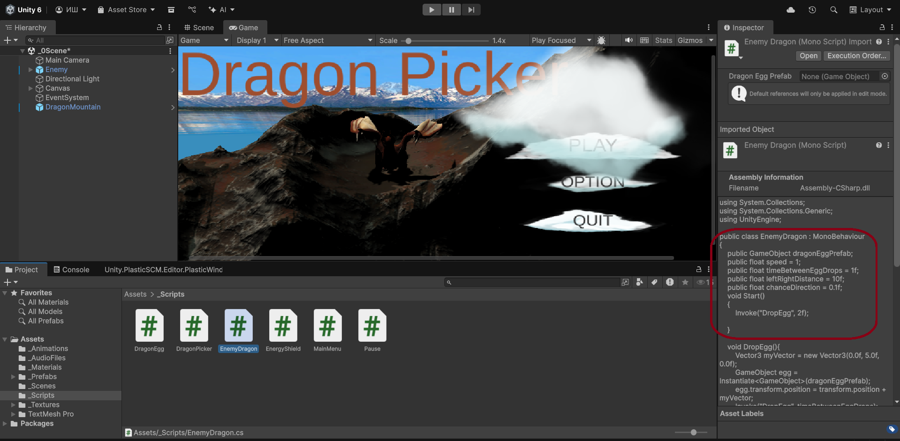
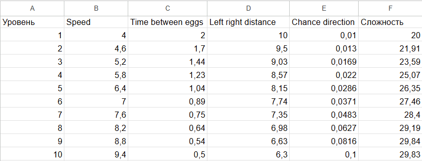
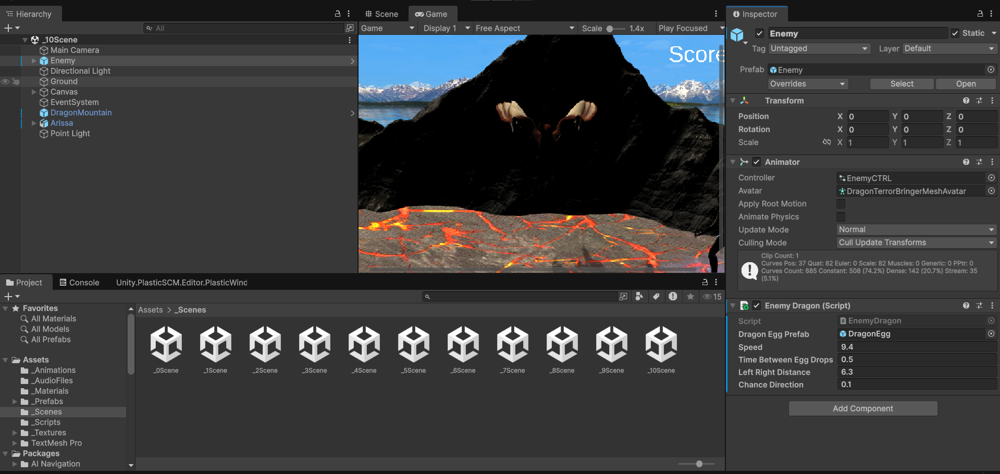
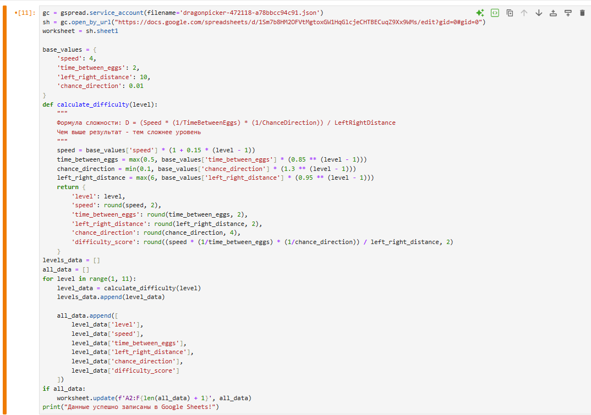
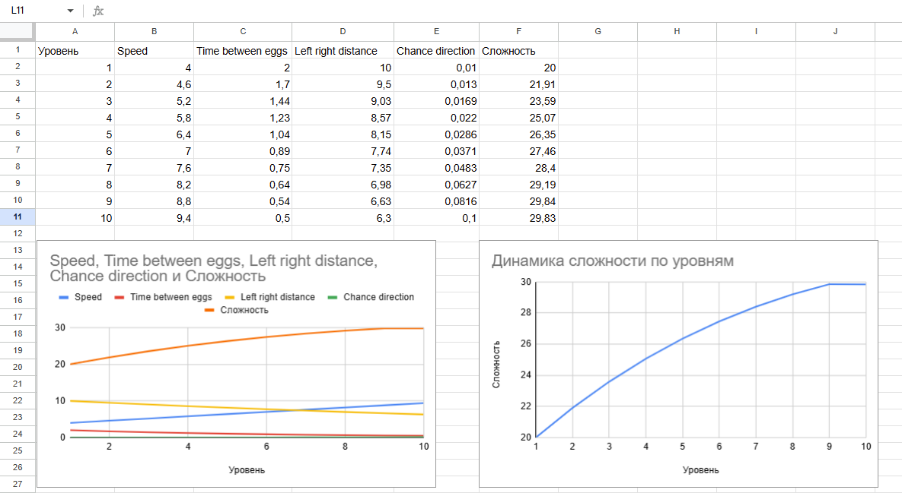

# АНАЛИЗ ДАННЫХ И ИСКУССТВЕННЫЙ ИНТЕЛЛЕКТ [in GameDev]
Отчет по лабораторной работе #3 выполнил(а):
- Макаридин Матвей Алексеевич
- НМТ-333719

Отметка о выполнении заданий (заполняется студентом):

| Задание | Выполнение | Баллы |
| ------ | ------ | ------ |
| Задание 1 | * | 60 |
| Задание 2 | * | 20 |
| Задание 3 | * | 20 |

знак "*" - задание выполнено; знак "#" - задание не выполнено;

Работу проверили:
- к.т.н., доцент Денисов Д.В.
- к.э.н., доцент Панов М.А.
- ст. преп., Фадеев В.О.

## Цель работы
Ознакомиться с прототипом игры Dragon Picker на движке Unity и, проанализировав движение дракона, предложить схему изменения переменных, влияющих на движение дракона на сцене и на сбрасывание драконьих яиц на сцене. Создать 10 сцен на Unity с изменяющимся уровнем сложности. Заполнить google-таблицу данными из Python. 

### Нахождение переменных влияющих на двжения дракона и на сбрасывание драконьих яиц:
- Speed - скорость движения дракона
- Time Between Egg Dragon - время между сбрасыванием нового яйца драконов
- Left Right Dictance -  диапозон допустимых изменений координат по X
- Chance Direction - частота изменения направления движения

Ход работы:
## Задание 1

### Создание 10 уровней игры с постепенно возрастающей сложностью
Формула для расчета сложности была придумала на основе переменных и их влияния на трудность прохождения уровня:

 Формула сложности: (Speed * (1/TimeBetweenEggs) * (1/ChanceDirection)) / LeftRightDistance

Прогрессия по уровням:

Speed: +15% за уровень (дракон ускоряется)

TimeBetweenEggs: -15% за уровень (яйца падают чаще, мин. 0.5 сек)

ChanceDirection: +30% за уровень (чаще меняет направление, макс. 0.1)

LeftRightDistance: -5% за уровень (меньше пространства, мин. 6 единиц)

[Самая таблица тут, да-да можно нажать](https://docs.google.com/spreadsheets/d/1Sm7b8HM2OFVtMgtoxGW1HqGlcjeCHTBECuqZ9Xx9WMs/edit?usp=sharing)
## Задание 2
Ознакомиться с результатами выполнения второго задания Вы можете по ссылке: https://drive.google.com/file/d/1JizZlOFisFq_Xkli5uafmenNlVlzNXzv/view?usp=drive_link

Окончательный проект выглядит так:

## Задание 3
### Решение в 80+ баллов должно визуализировать данные из google-таблицы, и с помощью Python передавать в проект Unity. В Python данные также должны быть визуализированы.

Программа в jupyter заполняет таблицу по формуле исходя из данных 1 уровня

Спустя множество попыток через питон передавать переменные в проект Unity, не одна из них не увенчалась успехом. Так что все было заполненно вручную
## Выводы
В игре Dragon Picker было проанализированно поведение объекта Enemy  и определены переменные от которых зависит сложность игры. Я научился работать с параметрами баланса, визуализировать их, расчитывать, а также применять алгоритм изменения параметров в юнити

| Plugin | README |
| ------ | ------ |
| Dropbox | [plugins/dropbox/README.md][PlDb] |
| GitHub | [plugins/github/README.md][PlGh] |
| Google Drive | [plugins/googledrive/README.md][PlGd] |
| OneDrive | [plugins/onedrive/README.md][PlOd] |
| Medium | [plugins/medium/README.md][PlMe] |
| Google Analytics | [plugins/googleanalytics/README.md][PlGa] |

## Powered by

**BigDigital Team: Denisov | Fadeev | Panov**
